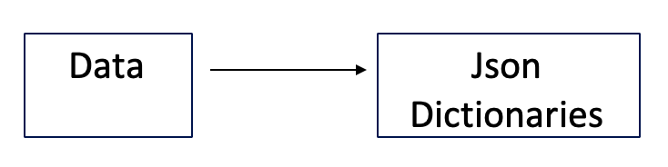
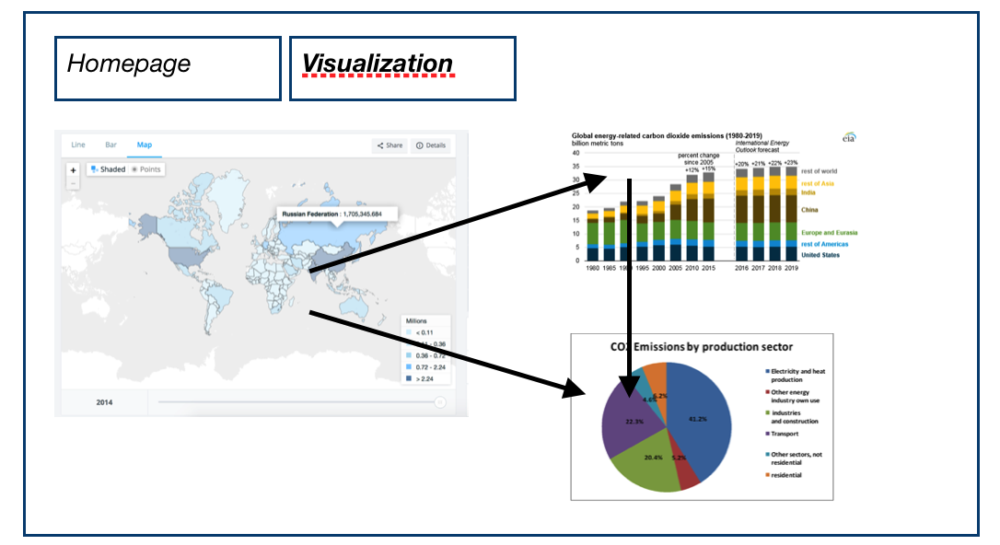

For the visualizations I'm planning to create, the following data is needed. A list of the CO2 emission per country, a list of the CO2 emission per region and a list of the CO2 emission per country, per sector. Thereby data is needed which tells us if a country signed the Paris agreement or not.
The following links contain all the data needed.

Data Sources  
> [Emission by region](https://cdiac.ess-dive.lbl.gov/trends/emis/tre_regional.html)  
> [Emission by nation](https://cdiac.ess-dive.lbl.gov/trends/emis/tre_coun.html)  
> [Emission by Sector](https://ourworldindata.org/co2-and-other-greenhouse-gas-emissions#emissions-by-sector)  
> [Parties of the Paris Agreement](http://paris-agreement-entry-into-force.openclimatedata.net/)  

---

The data is stored as csv and has to be parsed and then converted to a json file. The data can be filtered on base of country name and year. In the 'Parties of the Paris Agreement' dataset, every country who signed the Paris agreement has the concept "Ratification", "Approval" or "Acceptance" in its row.  

For the worldmap a dictionary will be used with every 'Year' as key. The value of this key is another key, the 'Country'. The 'Country' key has two values, the total CO2 emission and a yes or no, depending on if this specific country signed the Paris Agreement.

{  
	"2008": {  
		"Netherlands": "48274", "Yes",  
    		"Germany": "212862", "Yes", etc.}  
}

For the barchart another dictionary is created for the regions barchart. This dictionary is quite the same as above, the key is the Year and the value is the Region as key which has a value that is equal to the total emission of this region. Then there is also the country barchart for every region, therefore another dictinary is created. This dictionary has the Region as key, the value of this key is another key, the countries. The country key has as value which is the total emission of this country.

{  
	"2008": {  
		"Africa": "325814",  
		"Western Europe": "708718", etc.}  
  
}  

{  
	"2008": {  
		"Africa": {"Algeria": "30054", "Angola": "7011", etc.}  
    "Developing America": {"Antigua & Barbuda": "131", Argentina: "51570"}  
}  
}  

For the circle diagram a dictionary has a key which also is the year. This key has another key as value, the Country. This Country key has 9 values, where every value represents a section in the piechart. The order of the values should be the same for every country. So the first section of every pie chart for every country is always 'Transport, the second is always 'Forestry, the third is "Energy' etc.

{  
	"2008": {  
		"Netherlands": {"33188.7", "2713.3333", etc.}  
    		"Germany": {"157037", "26400"}  
}  
}  

---

The image above shows how the 3 visualizations interact with each other. When the user hovers over a country on the worldmap, the value of total CO2 emission is shown along with the yes or no regarding the Paris Agreement. A this moment the barchart only shows the bars from the regions with their total CO2 emissions plotted. When the users clicks on a country, the barchart will zoom in to the region this country belongs to and shows the barchart for all the countries in this region. The piechart shows how the emission from this country is divided through the different sectors. When the users clicks on a specific country in the barchart, the pie chart will adjust to this specific country.

---

### D3 Plugins
> D3 Tooltip  
> D3 Worldmap
