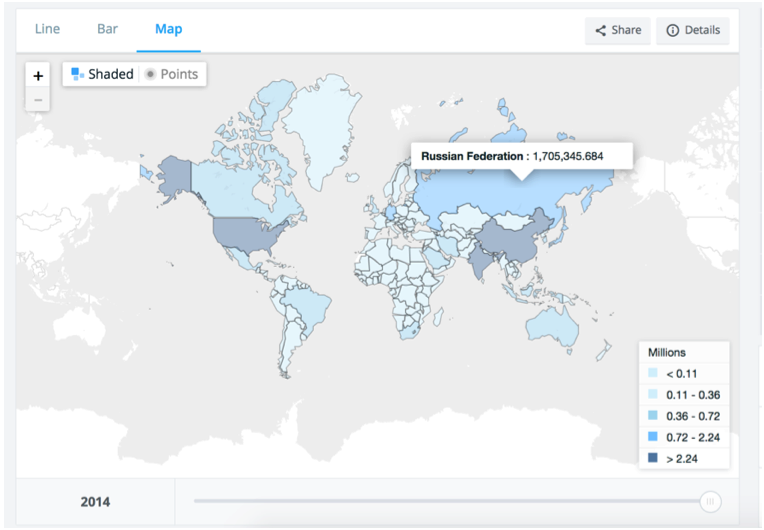
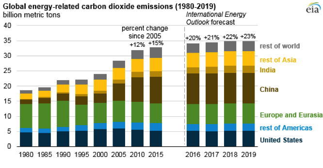
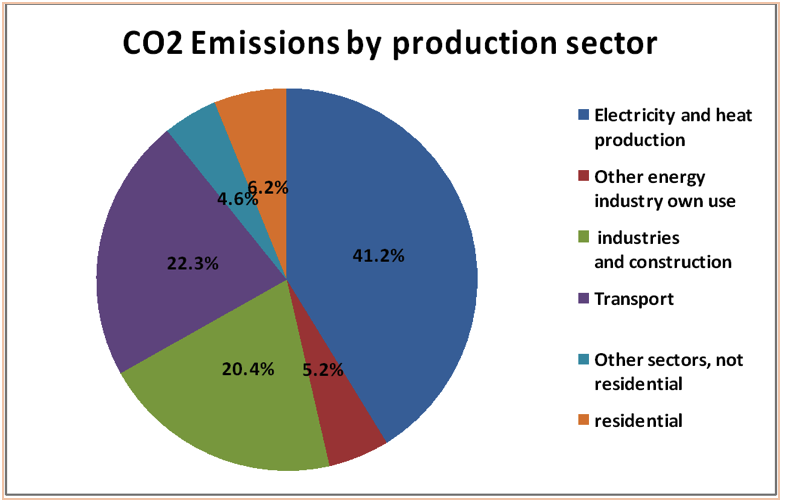
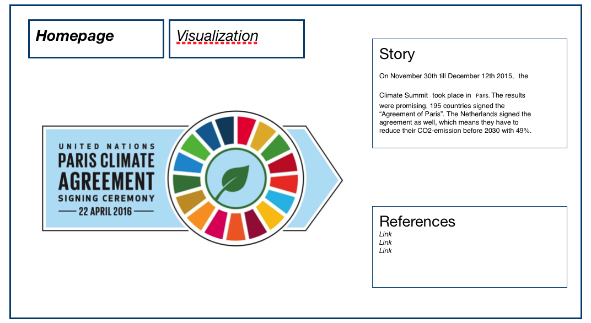

# Programmeerproject
## Description for project

### Author
> Rutger Storm  
> 12444049

### Link to Webpage

### Link to productvideo

## Short Summary
This webpage contains a worldmap which shows, which countries signed the Paris Agreement. The user can hoover over every country and when the users clicks on a country the following happens. A linegraph is shown, which shows the total CO2 emission of this country from 2000 till 2014. The user can click on a year in this linegraph, then a barchart is shown. The barchart visualizes how the CO2 of this country in this year is divided through different sectors.

## Homepage
The homepage is looking as follows, a short introduction on how the visualizations are relevant on the subject. In the upper left corner my name and studentnumber and a few inches below this the datasets used.

## What are the differences between countries in CO2 emission and how are these built up?

On November 30th till December 12th 2015, the Climate Summit took place in Paris. The results were promising, 195 countries signed the “Agreement of Paris”. The Netherlands signed the agreement as well, which means they have to reduce their CO2-emission before 2030 with 49%. Almost all the countries will have to reduce their CO2-emission strongly in order to reach the agreement. But first things first, what does the actual CO2 in all the countries look like through different sectors?

1.	Interactive world map with the CO2 emission per country and a slider to change the year. A tooltip gives the CO2 emission for every country and says if this specific country signed the agreement of Paris or not.

2.	Barchart which visualises the total emission per region. Divided in Africa, Developing America, Centrally planned Asia,             Centrally planned Europe, Far East, Middle East, North America, Oceania & Western Europe. The barchart below contains different regions but the unit on the x-axis is in years and the barchart is more like a stacked chart rather than a barchart. In my barchart, every country within a specific has it's own bar (x-axis) and the y-axis shows the amount of CO2 emission.

3.	Circle diagram for every country which visualises the share of each production sector in the nationaal CO2 emission. My pie chart contains the following sectors: Transport,Forestry,Energy,Other sources,"Agriculture, Land Use & Forestry",Waste,Residential & commercial,Industry & Agriculture.

## Sketch  
The website contains two tabs, the first tab is the homepage which tells you the story about the Paris Agreement and gives the references. As is shown in the sketches below, the other tab is the visualization tab. When the users clicks on a random country, the barchart will zoom in to the region in which region this country belongs and shows how this region is built up.
So for example; At first the barchart consists of bars where every region has its own bar. If the user clicks on a country in the worldmap, e.g the Netherlands. The barchart will zoom in to the region 'Western Europe', and shows a new barchart in which every country in Western Europe has it's own bar. At the same time the piechart shows how the total emission of the Netherlands is divided in the different sectors. When the users clicks on another country inside the Western Europe barchart, the piechart shows the total emission divided in the different sectors of this country.  

  

---

### Prerequisites
Data Sources  
> [Emission by region](https://cdiac.ess-dive.lbl.gov/trends/emis/tre_regional.html)  
> [Emission by nation](https://cdiac.ess-dive.lbl.gov/trends/emis/tre_coun.html)  
> [Emission by Sector](https://ourworldindata.org/co2-and-other-greenhouse-gas-emissions#emissions-by-sector)  

### External Components  
D3 Library, another libraries might follow

### Similar  
There is no visualization that uses all three subjects that I got

### Challenges  
It will be hard to parse through all the given data, it is data from every country, for different sectors for a period of almost 30 years. But after a long time of searching data, I've found all the data needed for the visualizations I wanted.
