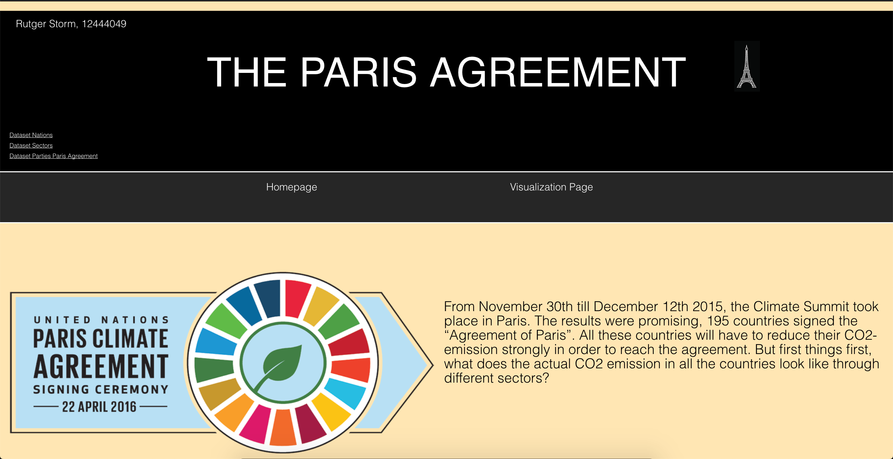
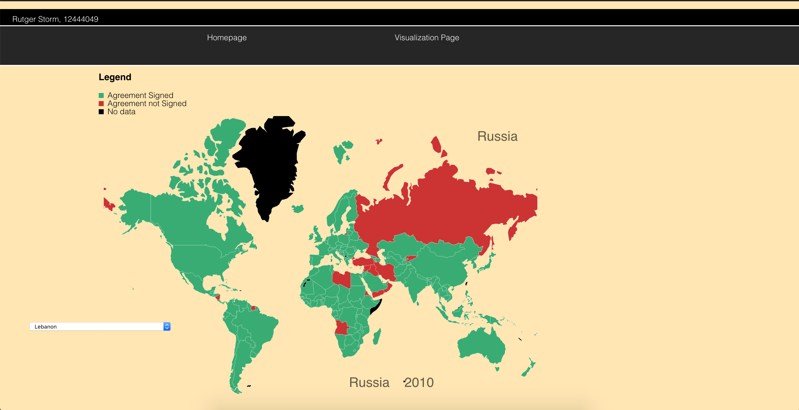
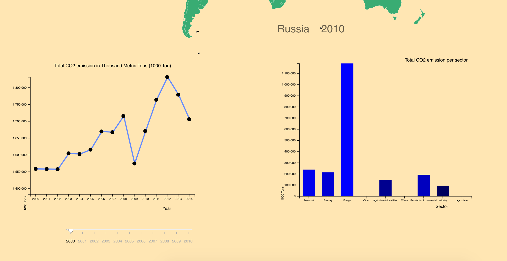

# Programmeerproject
## Description for project

### Author
> Rutger Storm  
> 12444049

### Link to Webpage
https://rutgerstorm.github.io/Programmeerproject/index.html

### Link to productvideo

## Short Summary
This webpage contains a worldmap which shows, which countries signed the Paris Agreement. The user can hoover over every country and when the users clicks on a country the following happens. A linegraph is shown, which shows the total CO2 emission of this country from 2000 till 2014. The user can click on a year in this linegraph, then a barchart is shown. The barchart visualizes how the CO2 of this country in this year is divided through different sectors.

## Homepage
The homepage is looking as follows, a short introduction on how the visualizations are relevant on the subject. In the upper left corner my name and studentnumber and a few inches below this the datasets used.

### Visualization Page
The visualization page is looking as follows, including a worldmap, linegraph and barchart.

### Worldmap

* The colors in the worldmap are based on which countries signed the paris agreement, see legend. 
* In contains a dropdown button for all the countries, in case you can't find the country you're interested in
* Tooltip for mouseover which shows the countries the cursor is on
* Tooltip which shows the country and year

### Linegraph

* Interactive scatter
* Tooltip for mouseover which shows the value of the current point in the graph

### Barchart

* Can be updated through a slider
* Can be updated through the linegraph
* Tooltip for mouseover which shows the value of the current point in the graph

## References 

Data Sources
> [Emission by nation](https://cdiac.ess-dive.lbl.gov/trends/emis/tre_coun.html)  
> [Emission by Sector](https://ourworldindata.org/co2-and-other-greenhouse-gas-emissions#emissions-by-sector)  
> [Parties of the Paris Agreement](http://paris-agreement-entry-into-force.openclimatedata.net/)  

D3 Plugins
> * D3 Tooltip  
> * D3 Worldmap  
> Other might follow during the process
