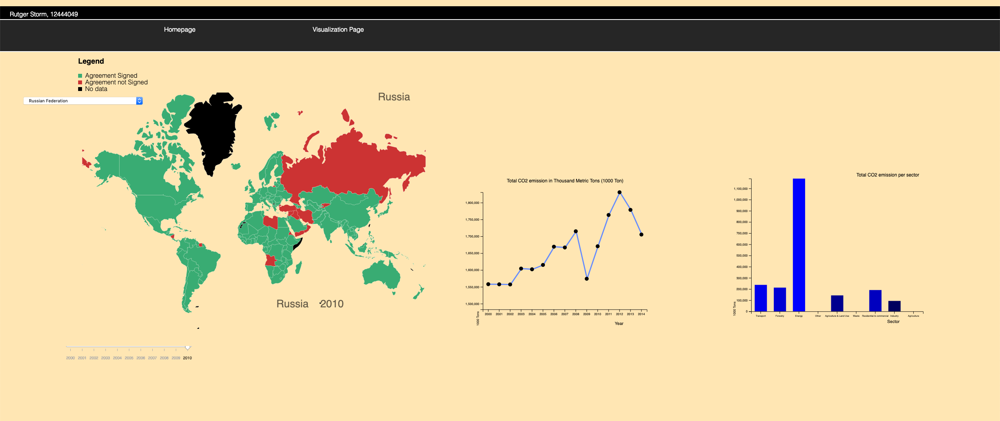
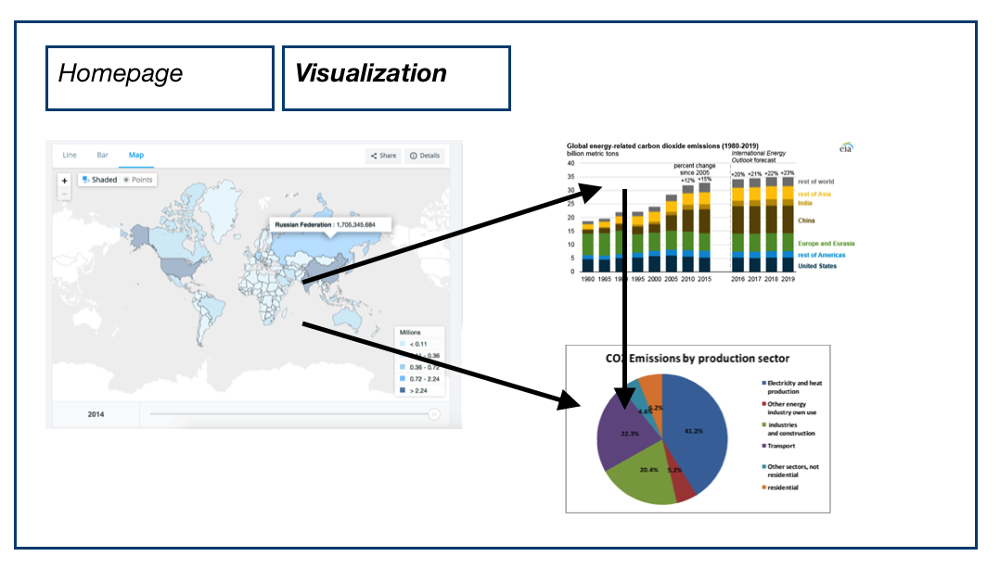

## Final report Programmeerproject

## Description

My webpage contains a worldmap which shows, which countries signed the Paris Agreement. The user can hoover over every country and when the users clicks on a country the following happens. A linegraph is shown, which shows the total CO2 emission of this country from 2000 till 2014. The user can click on a year in this linegraph, then a barchart is shown. The barchart visualizes how the CO2 of this country in this year is divided through different sectors.

## Technical Design  
My webpage contains two pages, a homepage and a visualization page. Therefore I've used two html files, index.html for the homepage and visualization.html for the visualization page. Layout for these pages is done in a general css file, called programeerproject.css. The visualization page contains three different visualizations, a worldmap, a linegraph and a barchart. For every visualization, a seperate Javascript file is used. Called worldmap.js, linegraph.js and barchart.js. To convert the data to usuable json files, 3 python files are used, nation_converter.py, sector_converter.py and paris_agreement_converter.py.

### Converter  
The data for the linegraph had to be in the following format:   
{  
"2008": {  
"Netherlands": "48274", ..,  
"Germany": "212862", .., etc.}  
}  
This was quite easy, opening the csv file, if the row is equal to column "year", 
years selected from 2000 till 2014, then year is the key, with another
dictionary as value wherin nation the key is and the value is the value of
total CO2 emission.  

---
The data for the Paris agreement had to be in the following format:  
{"Afghanistan": "Yes", "Albania":"Yes" .. }

Opening the csv file, if "Ratification", "Acceptance" or "Approval" was in the
row of the country, it means this country signed the agreement. So then Yes was the value of the country,
if not, No was the value of the country.   

---
The data for the barchart had to be in the following format:  
{"2000": {"AFGHANISTAN": ["269.17", "0", "96.7", "0", "0", "0", "182", "147.59", "0"]  

Opening the csv file, if the row is equal to column "year", years selected from 2000 till 2014,  
then year is the key, with another dictionary as value. In this dictionary the country ("Entity") 
is the key and a list of the 9 different sector values is the value.

---

### Worldmap
The worldmap.js contains 2 functions called 'createCountryTitle' and 'createYearTitle'. These functions function are invoked when the users clicks on a country. The country and year on which is clicked is shown. The variable tooltip, is used the shows the tooltip in the upper right corner, so the user can see over which country they hoover. The function dataParis links the data about the Paris Agreement to the countries, Yes if they signed the agreement, No if they haven't. The function worldmapLayout, is used to layout the worldmap. For example, the colours of the countries, the hoover function and the on click. This onclick functions calls in four different functions. 'makeLineChart', 'createBar', 'createCountryTitle' and 'createYearTitle'. The createCountryTitle and createYearTitle are described above, the other will be described in the following sections. 

### Linegraph  
The first function in the linegraph Javascript file, is the dropDown function. This function gives the name of the country chosen from the dropdown, to the makeLineChart function. The makeLineChart can have 2 inputs, the dropdown and the onclick from the worldmap. When the input is made the following happens, the json file containing all the information from the countries, is opened. Then through a for- and if loop, it is checked if there's any data available for this country, if not the createCountryTitle prints: "No data Available". If there is data available the data is formatted and stored in a list called "dataList". The function textUnits gives the graph a title and axis units. The scatter is an important part of the linegraph, the scatter makes use of the x and y from the linegraph function. Then a scatter is plotted over the linegraph. This scatter contains an onclick which calls in the createBar function. By this way the lingegraph is linked to the barchart. 

### Barchart  
The barchart Javascript file starts with a 'sliderPresent = true' (later more on this). The createBar function is the first function in this file, it gets input from the worldmap or the linegraph(scatter). The input contains of two elements, a year and a country. This year(x) and country(y) are used to search the right data from the data_sectors.json file. The data from country y and year x. The right data is now stored in a variable called 'data'. Then the next function comes by, makeBar, concerning the total barchart file. The svg element was already present but had no width nor height. So this is done first, thereby some general elements for the barchart are added. For example the units for the axis and the title. Then there is an if loop with the variable sliderPresent we've seen earlier. The sliderPresent is true, so it get's in the if loop and they it's immediatly turned to false. This prevents the slider from appending itself more than once. The function barchart is the one creating the bar. Rect are appended based on the data called 'data', made in the beginning of the file. The tooltip is set at a absolute position. The rects and data are stored in a variable called bar. This variable is merged and the bars are updated, this is how the barchart update function works. The latest function is the createAxis, these also had to be updated through a transition function. 

## Challenges
In my proposal I've had a plan written out which was totally different compared to the end result. The image below shows some sketches of my first plan from the proposal. 

The biggest challenge for this was converting the data for the barchart in the right way. This had to be done as follows:  
{  
"2008": {  
"Africa": {"Algeria": "30054", "Angola": "7011", etc.}  
"Developing America": {"Antigua & Barbuda": "131", Argentina: "51570"}  
}  
}  
I had to combine two datasets, one for the regions and one for the countries. After a few days in, I realised there was no note in neither of the files that says which country belonged to which region. So another txt file was used to get this information. So the challenge was to combine 3 different files from different length and format. This took way to much time, this resulted in a big turnover. The big turnover was as follows, the worldmap stayed, but the barchart was replaced with a linegraph and a barchart about the sectors was replacing the piechart. The data for the linegraph was much easier to get and the data for the new barchart was already there. The plans were made on a thursday, one day before the deadline of the alpha version. At this point in only had worldmap without any colours and a hoover function that barely worked. So there was a lot work to catch up with. But it was defitely the right choice, I was confident about this new plan.   

This really made me realise how dynamic the total process of programming can be. Eventhough a proposal plan was made months before this project started, with a plan thought through. This plan changed from one day to another in something totally different. After the turnover it all went much better than before, I knew what had to be done, in which way and when. 

